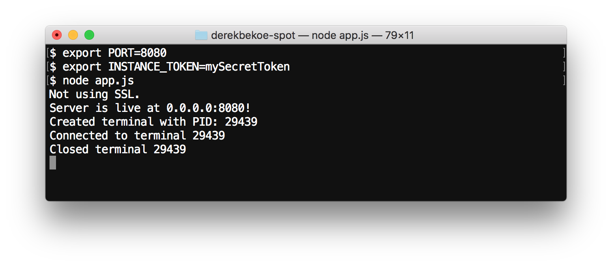
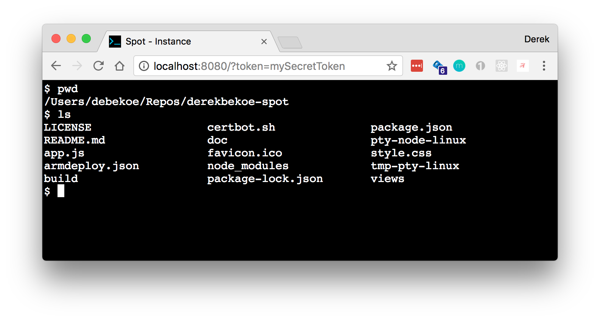
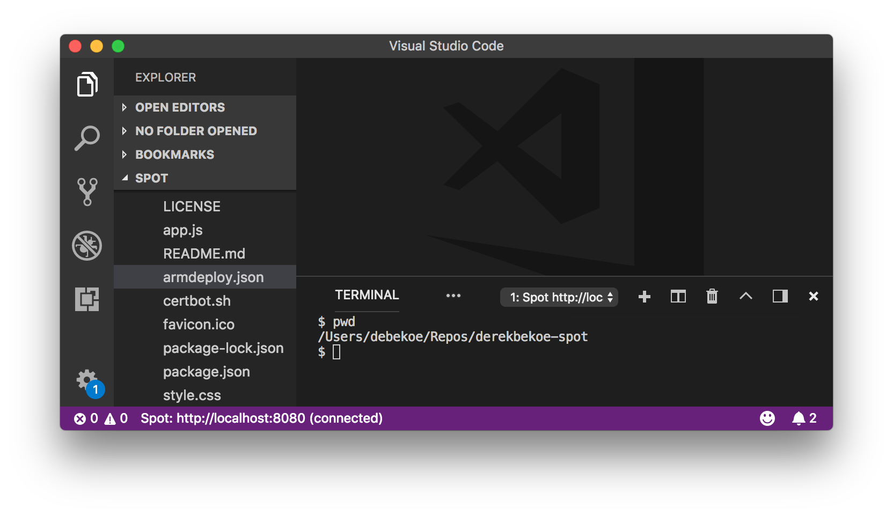

# Spot Host: The host that powers the VS Code extension

This repository is for the Spot Host.

The Spot Host powers the [Spot VS Code extension](https://github.com/derekbekoe/vscode-spot).

- Node.js server (packaged using [pkg](https://github.com/zeit/pkg))
- Runs on a specified PORT with a set INSTANCE_TOKEN
- All endpoints require valid token otherwise 401 Unauthorized
- HTTP & HTTPS available

*Image1: Spot host running*

*Image2: Connecting to host in browser*

*Image3: Connecting to host in VS Code*


## Quickstart

A few steps to get you started right away:

**Download latest Spot Host**
```
# For linux
wget https://vscodespot.blob.core.windows.net/preview/spot-host
wget https://vscodespot.blob.core.windows.net/preview/pty.node
```

**Start the host**
```
chmod +x spot-host
export PORT=8080
export INSTANCE_TOKEN=mySecretToken
./spot-host
```

## Configuration

The following environment variables can be configured:

| Name | Description |
| --- |---|
| `PORT`     | The port to run the host on.
| `INSTANCE_TOKEN`    | The token required to connect to the Spot Host.
| `USE_SSL` | (optional) `'1'` if SSL should be usedl otherwise, don't use SSL.
| `C_DOMAIN`  | (optional) The domain that SSL is provided for. Used in `/etc/letsencrypt/live/C_DOMAIN/[privkey.pem,fullchain.pem]` to find the certs.

## Developer Setup

Looking to contribute or debug yourself?

1. Clone the repository
2. Run `npm install`
3. Run `export PORT=3000`
4. Run `export INSTANCE_TOKEN=mySecretToken`
5. Run `node app.js`

### Packaging

**Fix up pty.node**

In `node_modules/node-pty/lib/unixTerminal.js`, search for `pty.node` and modify that line:

```js
var pty = process.pkg ? require(path.join(path.dirname(process.execPath), 'pty.node')) : require(path.join('..', 'build', 'Release', 'pty.node'));
```

This will allow the server to work after being packaged with [pkg](https://github.com/zeit/pkg).

Copy `pty.node` from `node_modules/node-pty/build/Release/pty.node` to the same directory as the spot host (see [pkg native-addons](https://github.com/zeit/pkg#native-addons)).  

**Build**

Build package: `node_modules/.bin/pkg --out-path build package.json`

**Run**

Set the required environment variables.

Run the Spot Host: `./build/spot-host-macos` or `./build/spot-host-linux`  

## Release History
See [GitHub Releases](https://github.com/derekbekoe/spot/releases).

## License
[MIT](LICENSE.md)
